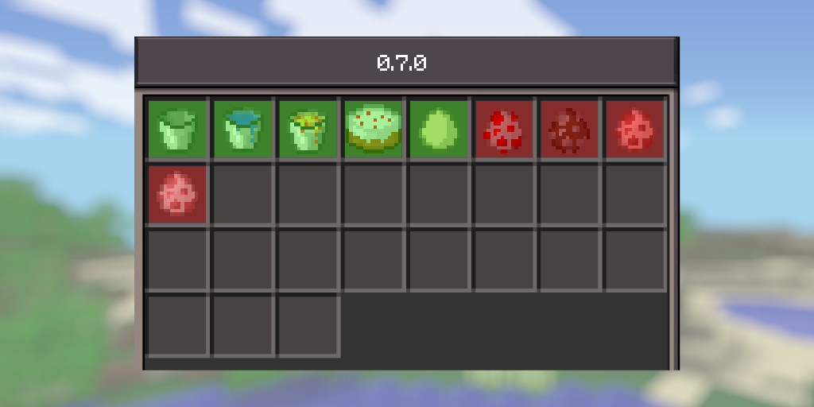

# NeoMCPE 0.7.1-alpha-1.0.2b

## Changes

* Fully port mcpe 0.7.1
* Putting lava in a furnace no longer breaks the fire gui texture
* Fixed some important gui bugs
* Fixed flowing lava depth not correctly updating in accordance with surrounding lava until receiving a random tick.
* Fixed losing milk buckets when crafting cake.
* Sprint-jumping is now faster than sprinting(you can now do 4 block parkour jumps)
* Changed the logo on the mainmenu to the one in 0.7.1

## Known bugs
* Something seems wrong with the chat packet as it dosnt recognise the one from real 0.7.0
* The scrolling in TouchSelectWorldMenu is not accurate to real 0.7.0 as i couldnt figure out how to port it(its really buggy rn)
* The TextBox(not component and Chat menus have not been ported yet)
* The options category texts are slightly indented in real 0.7.0 while they're not in this port

## Roadmap

